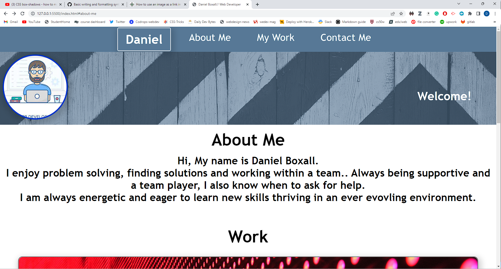

# My Portfolio page
[link to deployment](https://daniel-boxall.github.io/DanielBoxallPortfolio/)

___

# RoadMap

1. Add projects.
2. Add a blog.
3. Add Whatsapp api, so i can be directly contacted from the app.
4. redesign the app when i have better UI skills.

Currently there are no projects so all the project cards are placeholders.

___

